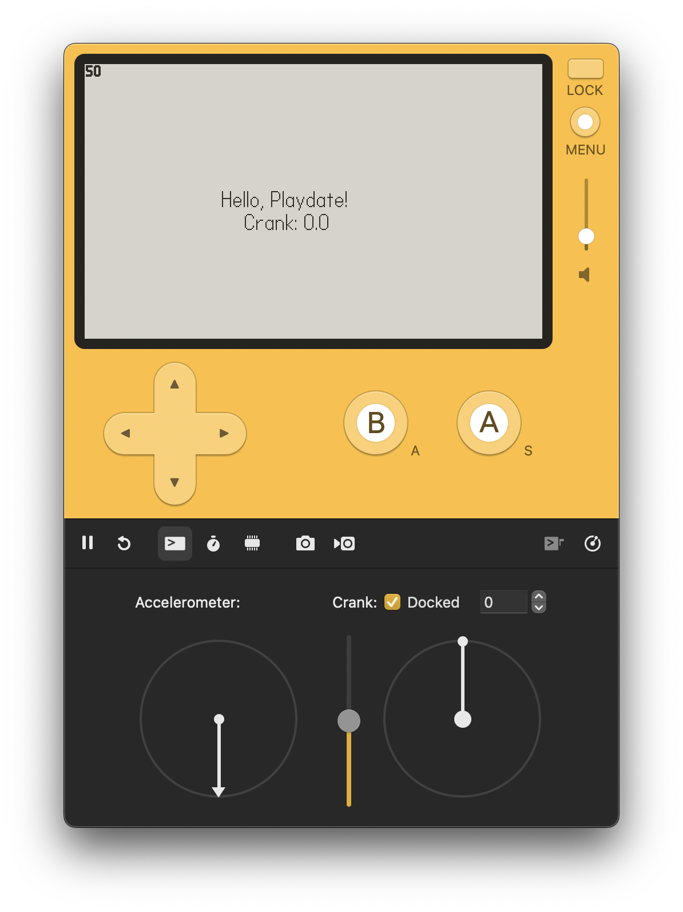

# Playdate C Template

A starter template for developing Playdate games using C and CMake.
You will be able to build, debug and run your game on both the Playdate Simulator and the actual device.



## Prerequisites

- [Playdate SDK](https://play.date/dev/)
- CMake 3.14 or later
- Make sure `PLAYDATE_SDK_PATH` is set in your environment, or `SDKRoot` is configured in `${userHome}/.Playdate/config`
- (Optional) [ffmpeg](https://ffmpeg.org/) — for audio conversion and normalization scripts

## Resources

- [Playdate SDK Documentation](https://sdk.play.date/)
- [Inside Playdate C API](https://sdk.play.date/Inside%20Playdate%20with%20C.html)
- [Playdate Developer Forum](https://devforum.play.date/)

## Project Structure

```
playdate-template-c/
├── .vscode/              # VSCode configuration (tasks, launch, settings)
├── cmake/
│   ├── bump_version.cmake    # Auto-increment buildNumber on each build
│   └── package_release.cmake # Package device build into versioned zip
├── scripts/
│   ├── convert_audio.sh      # Convert WAVs to Playdate format (mono 16-bit PCM)
│   └── normalize_audio.sh    # EBU R128 loudness analysis and normalization
├── src/
│   └── main.c            # Main game source code
├── Source/
│   ├── pdxinfo           # Game metadata (name, version, buildNumber)
│   ├── images/           # Image assets
│   └── sounds/           # Sound assets
├── .gitignore
├── CMakeLists.txt        # CMake build configuration
├── Makefile              # Convenience build targets
├── LICENSE
└── README.md
```

## Build

Note, all these steps were made and tested on macOS. Adjust accordingly for Linux or Windows.

Playdate SDK must be installed and `PLAYDATE_SDK_PATH` environment variable set to the SDK location.

### Using Make (recommended)

The `Makefile` provides convenience targets that handle cmake configure + build in one step:

| Command | Description |
|---------|-------------|
| `make` | Configure + build for simulator |
| `make run` | Build and launch in simulator |
| `make device` | Configure + build for device |
| `make deploy` | Build and deploy to connected Playdate via USB |
| `make demo` | Configure + build demo for simulator |
| `make demo-run` | Build demo and launch in simulator |
| `make demo-device` | Configure + build demo for device |
| `make demo-deploy` | Build demo and deploy to connected Playdate via USB |
| `make release` | Build device + package versioned zip to `releases/` |
| `make release-demo` | Build demo device + package versioned zip to `releases/` |
| `make mount` | Mount connected Playdate as data disk |
| `make clean` | Remove all build directories |

### Using CMake directly

**Simulator:**

```bash
cmake -B build -DCMAKE_BUILD_TYPE=Debug -DCMAKE_C_COMPILER=clang
cmake --build build
```

**Device:**

```bash
cmake -B build-device -DCMAKE_BUILD_TYPE=Release -DTOOLCHAIN=armgcc --toolchain=$PLAYDATE_SDK_PATH/C_API/buildsupport/arm.cmake
cmake --build build-device
```

Both will create a `template.pdx` folder ready to run.

### Using VSCode

Use the VSCode build tasks (`Cmd+Shift+B`) or the debugger (`F5`) to build and launch the Playdate Simulator. Available tasks:

- **Playdate: Build** — configure + build for simulator
- **Playdate: CMake Configure Device** — configure device build
- **Playdate: Build Device** — build for device
- **Playdate: Build Demo** — configure + build demo for simulator
- **Playdate: Build Demo Device** — build demo for device
- **Playdate: Clean** — remove all build directories

## Run

### Simulator

Build and launch in one step:

```bash
make run
```

Or open the Playdate Simulator and drag the `template.pdx` folder onto it:

```bash
open $PLAYDATE_SDK_PATH/bin/Playdate\ Simulator.app template.pdx
```

### Device

Deploy directly to a connected Playdate via USB:

```bash
make deploy
```

This will build for device, mount the Playdate data disk, sync the `.pdx`, eject, and run the game on the device.

### Debugging (VSCode)

Use `F5` to launch the Playdate Simulator with LLDB debugging. You can set breakpoints and step through your code.

## Build Features

### Auto Version Bumping

Every build automatically increments the `buildNumber` in `Source/pdxinfo`. The version field (`X.Y.Z`) stays unchanged — bump it manually when releasing a new version.

### Demo Builds

The template supports building a demo variant. When built with `-DDEMO=ON`, the `DEMO` preprocessor macro is defined so you can conditionally compile demo-specific code:

```c
#ifdef DEMO
    // Demo-specific logic
#endif
```

Demo builds also automatically patch `pdxinfo` in the output `.pdx` to append "Demo" to the name and "-demo" to the bundleID.

### Resource Tracking

Changes to resource files (e.g. `pdxinfo`) are tracked by CMake and will trigger a rebuild + re-bundle with `pdc` automatically.

### Release Packaging

Build a versioned release zip for distribution:

```bash
make release
```

This creates `releases/template_vX.Y.Z-buildNumber.pdx.zip`.

For demo releases:

```bash
make release-demo
```

This creates `releases/template_vX.Y.Z-buildNumber-demo.pdx.zip`.

## Audio Tools

Helper scripts for managing audio assets. Requires `ffmpeg` (`brew install ffmpeg`).

### Convert Audio

Convert all WAV files in `Source/sounds/` to Playdate-compatible format (mono 16-bit PCM at 11025 Hz):

```bash
make audio-convert
```

### Normalize Audio

Analyze loudness of all audio files:

```bash
make audio-normalize
```

Normalize all files to a target loudness (EBU R128):

```bash
make audio-normalize TARGET_DB=-16
```

Dry run (preview changes without writing):

```bash
make audio-normalize TARGET_DB=-16 DRY=1
```

## License

MIT License

Copyright (c) 2026

Permission is hereby granted, free of charge, to any person obtaining a copy
of this software and associated documentation files (the "Software"), to deal
in the Software without restriction, including without limitation the rights
to use, copy, modify, merge, publish, distribute, sublicense, and/or sell
copies of the Software, and to permit persons to whom the Software is
furnished to do so, subject to the following conditions:

See LICENSE file for full details.
